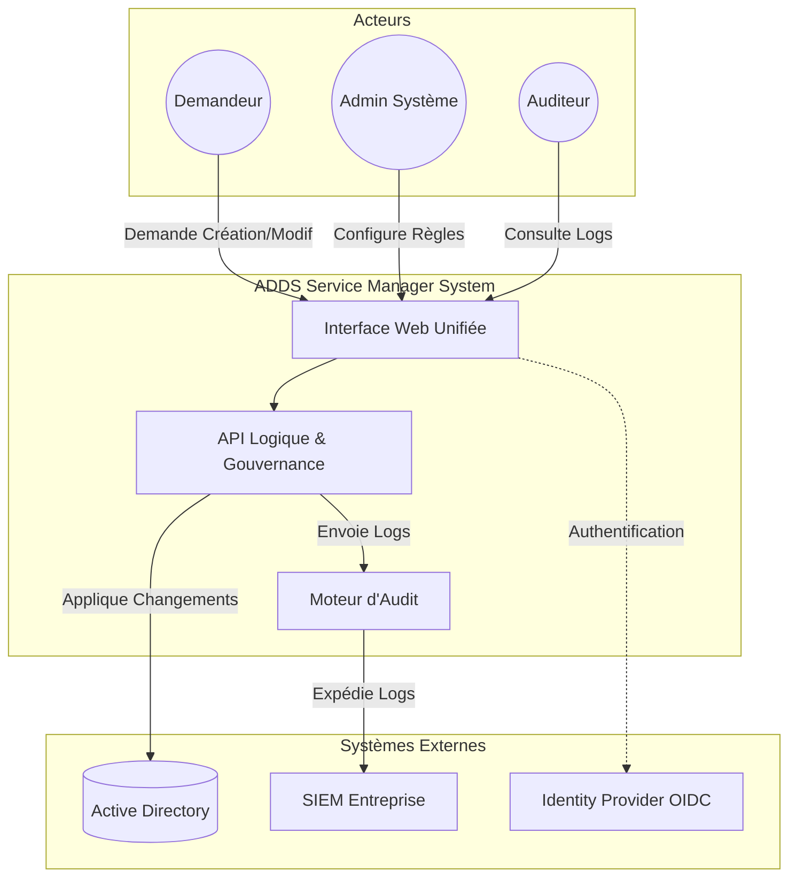
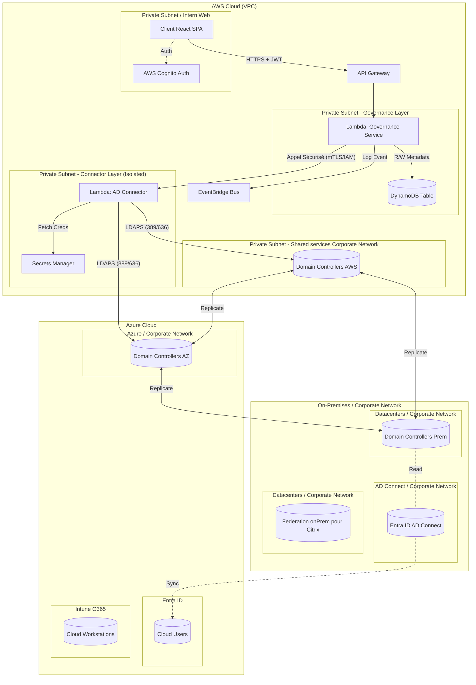
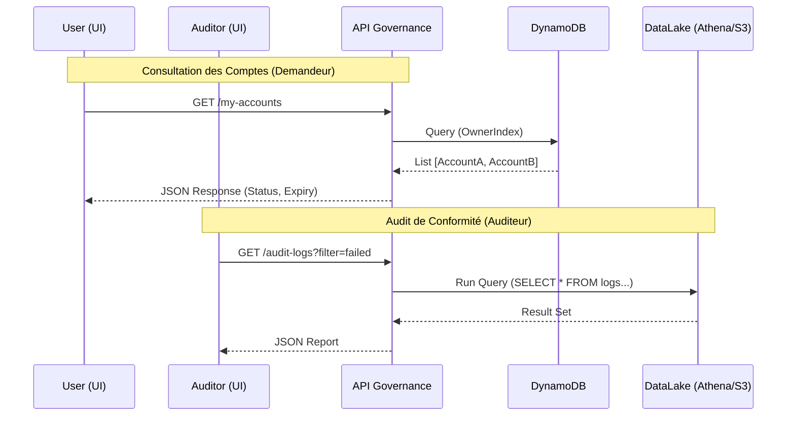
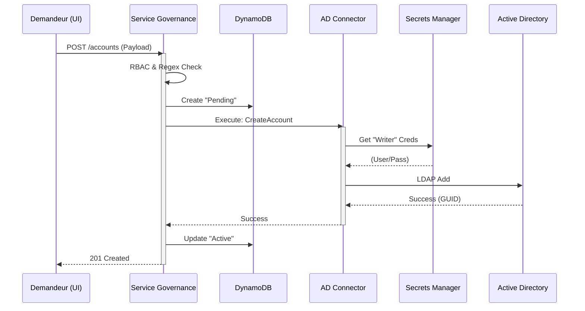
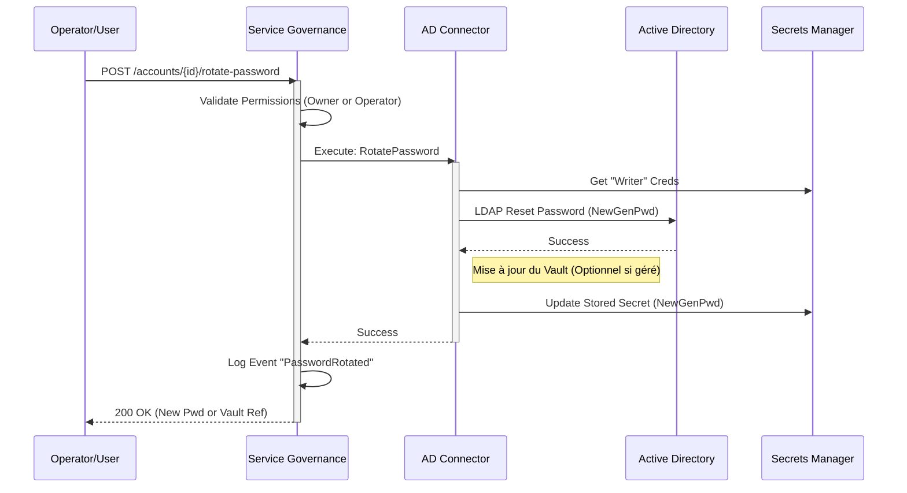
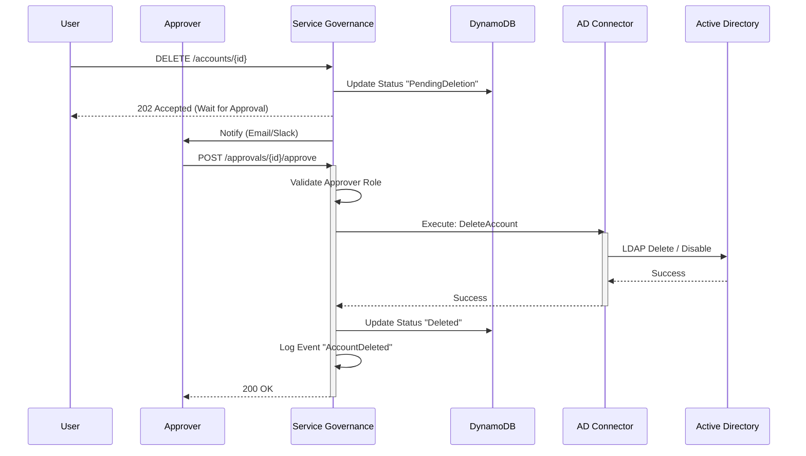

# Architecture Solution : SAGAPI (Service Account Governance & Automation Programmable Interface)

**Type** : Document d'Architecture Logicielle (SAD) - Format TOGAF

**Approche** : Monorepo Modulaire, Serverless, Zero TrustStatut : Version Validée pour le Développement.

## 1.Business Architecture (Solution Métier)

Cette section décrit les objectifs, les acteurs et les processus métier que la solution doit supporter.

### 1.1 Objectifs Stratégiques

- **Centralisation & Gouvernance** : Offrir un point d'entrée unique pour la gestion du cycle de vie des comptes de service (création, modification, rotation, suppression).
- **Sécurité Zero Trust** : Éliminer l'accès direct des administrateurs aux contrôleurs de domaine pour les tâches courantes. Appliquer le principe de moindre privilège.
- **Agilité & Indépendance** : Permettre à plusieurs équipes de développer des fonctionnalités en parallèle via une structure modulaire centralisée (Monorepo).

### 1.2 Capacités Métier (Business Capabilities)

Le système doit fournir les capacités suivantes :

1. **Gestion des Identités (IAM)** : Authentification unique, gestion des personas.
2. **Gestion du Cycle de Vie (LCM)** : Création, modification, désactivation, suppression de comptes ADDS.
3. **Gouvernance & Conformité** : Application automatique des conventions de nommage, workflows d'approbation, audit complet (qui a fait quoi et quand).
4. **Gestion des Droits (RBAC)** : Application du modèle AGDLP (Account, Global, Domain Local, Permission).Visualisation (Dashboard) : État de santé des comptes, expiration des mots de passe.

### 1.3 Acteurs et Personas

| Acteur | Rôle | Responsabilités |
| ------ | ---- | --------------- |
| Demandeur (Dev/Ops) | User | Demander la création d'un compte de service pour une application. Consulter ses propres comptes. |
| Approbateur (Secu/Lead) | Approver | Valider ou rejeter les demandes de création sensibles. |
| Opérateur AD | Operator | Intervenir en cas d'échec technique, forcer des rotations. |
| Administrateur Système | Admin | Configurer les règles de nommage, les FGPP (Password Policies), et les connexions aux domaines. |
| Auditeur | Auditor | Consulter les logs d'accès et d'opérations (Read-Only). |

## 2. Architecture Solution (Applicatif & Données)

Cette section détaille comment le logiciel est structuré pour répondre aux besoins métier.

### 2.1 Stratégie Monorepo (Le Code)

Pour garantir la cohérence des contrats d'interface et permettre des "Atomic Commits", tout le code réside dans un Monorepo Git unique.
La structure a été organisée selon les standards Nx "Grouped" pour séparer clairement les responsabilités Frontend, Backend et Data.

#### Structure des Dossiers (File Structure)

```Text
/ (Root)
├── /apps
│   ├── /frontend             # Applications Web (React)
│   │   ├── /shell            # Application hôte (Auth & Routing)
│   │   ├── /ops              # Micro-frontend "Opérations" (Espace User)
│   │   └── /admin            # Micro-frontend "Administration" (Espace Admin)
│   │
│   ├── /backend              # Services Serverless (.NET 8)
│   │   ├── /governance       # API Cerveau décisionnel (Logique Métier)
│   │   └── /connector        # API Connecteur AD isolé (Zero Trust)
│   │
│   └── /data                 # Outils de données
│       └── /db-migrations    # Scripts de gestion schéma DynamoDB
│
├── /libs                     # Bibliothèques Partagées (Non déployables seules)
│   ├── /shared               # Code agnostique (C# & TS)
│   │   └── /contracts        # DTOs, Enums et Interfaces partagés (Source de vérité)
│   └── /ui                   # Composants React
│       └── /components       # Design System (Boutons, Tableaux, Layouts)
│
├── /docs                     # Documentation
│   ├── /architecture         # Diagrammes et SAD
│   ├── /governance
│   ├── /runbooks
│   ├── /wiki
│   └── /adrs                 # Architecture Decision Records
│
├── /scripts                  
│   └── /security
│
└── /infra                    # Infrastructure as Code (Terraform/CDK)
```

- **Principe de Cohérence** : Le dossier /libs/shared/contracts est la source de vérité absolue.
Il est référencé par les projets C# (/apps/backend) et utilisé pour générer les types TypeScript pour les frontends (/apps/frontend), garantissant qu'aucun changement d'API ne casse l'UI silencieusement.

### 2.2 Architecture Applicative (Micro-Frontends & Services)

#### A. Couche Présentation (Frontend React)

Architecture "**Shell & Workspaces**" :

1. **UI-Shell (L'Hôte)** : * Gère l'authentification avec AWS Cognito.

- Récupère le token JWT et le distribue aux sous-modules.
- Contient les "Guards" React pour la gestion RBAC (ex: affichage conditionnel selon le claim scope: adds.admin).

2. **Workspaces (Modules UI)** :

- Applications React isolées dans /apps/frontend.
- Peuvent être lancées indépendamment pour le développement.

3. **Shared UI Lib** :

- Assure l'uniformité visuelle (Boutons, Tableaux, Layouts) à travers tous les micro-frontends.

#### B. Couche Logique (Backend C# .NET 8)

Architecture **Clean Architecture** distribuée en Lambdas :

1. **Core.Contracts (Shared Lib)** : Contient les interfaces, DTOs et Enums. C'est la "Vérité Unique" partagée.

2. **Service.Governance (Lambda)** :

- **Rôle** : Cerveau décisionnel.
- **Fonctions** : RBAC applicatif (Traduction User -> Droits), validation regex nommage, orchestration des workflows.

3. **Service.ADConnector (Lambda - Zero Trust)** :

- **Rôle** : Bras armé (Exécution technique).
- **Isolation** : Déployée dans un VPC privé isolé.
- **Sécurité** : Authentification stricte (mTLS/IAM) avec le service Governance. Aucune logique métier complexe.

### 2.3 Architecture de Données

#### A. Données Chaudes (État Applicatif) - OLTP

- **Technologie** : Amazon DynamoDB (Single Table Design).
- **Usage** : Stockage temps réel des métadonnées, état des workflows, mapping Utilisateur/Rôles.

#### B. Données Froides (Audit & Historique) - OLAP

- **Technologie** : S3 + Glue + Athena (Data Lake).
- **Stratégie** : "Write-to-Log". Chaque action (Succès/Échec) émet un événement JSON -> EventBridge -> Kinesis Firehose -> S3 (Parquet).

## 3. Infrastructure Solution (Technologie)

Cette section décrit l'infrastructure Cloud AWS supportant la solution.

### 3.1 Composants Compute & Network

- **Compute** : AWS Lambda (Runtime .NET 8).
- **API Gateway** : Point d'entrée REST unique. Gère le throttling et la validation initiale.
- **Réseau (VPC)** :
  - **Private Subnet** : API Gateway. only enpoints are exposed.
  - **Private Subnet (App)** : Lambdas Governance.
  - **Private Subnet (Isolated)** : Lambdas ADConnector (Connectivité VPN vers AD on-premise).

### 3.2 Chaine de Production (CI/CD Factory)

L'utilisation du Monorepo impose une chaine de production intelligente pour éviter les temps de build excessifs.

#### Outils & Stratégie

- **Source** : GitHub (Monorepo).
- **Orchestrateur** : GitHub Actions.
- **Build Intelligence** : Nx (Extensible Build Framework).

#### Optimisation du Build avec Nx

1. **Graphe de Dépendance ("Affected Graph")** : Nx analyse statiquement les imports. Si /apps/frontend/ops est modifié, il sait qu'il ne doit pas re-tester /apps/frontend/admin.
2. **Computation Caching** : Si le module /libs/shared/contracts n'a pas changé, Nx restaure les artefacts compilés depuis le cache (Local ou Remote) instantanément.
3. **Résultat** : Temps de CI constant (~minutes) même si le projet grossit x10.

#### Workflow de Développement (Feature Branch)

1. **Branche Feature** : L'équipe crée feature/ajout-champ-ticket.
2. **Développement** : Modification atomique dans /libs (Contrat), /backend (API) et /frontend (UI).
3. **Test Local** : Lancement conjoint API + UI en local facilité par le monorepo.
4. **Pull Request & CI** :

- La CI détecte les dossiers modifiés.
- Si /libs/shared/contracts est touché -> Recompilation et Tests de TOUS les consommateurs pour garantir la non-régression.

## 4. Security Architecture

Cette section détaille l'approche Zero Trust et la sécurisation des flux.

### 4.1 Identité et Accès (IAM)

- **Utilisateurs** : Authentification via AWS Cognito (MFA obligatoire).
- **Application** : Les Lambdas utilisent des Rôles IAM minimaux. Le Frontend n'a JAMAIS accès aux identifiants AD.

### 4.2 Modèle Zero Trust pour l'ADDS

Pattern **Identity Strategy** pour l'isolation stricte :

1. **Stockage Sécurisé** : AWS Secrets Manager contient 3 identités distinctes :

- secret-reader (Lecture seule).
- secret-writer (Création/Modif, sans delete).
- secret-deleter (Suppression, nécessite approbation forte).

2. **Injection Dynamique** : Le service ADConnector ne récupère le secret nécessaire qu'au moment de l'exécution, sur ordre validé par Governance

### 4.3 Sécurité des Données

- **Chiffrement** : KMS (AES-256) au repos (DynamoDB, S3, Secrets). TLS 1.3 en transit

### 5. Annexes (Diagrammes & Matrices)

#### A. Diagramme de Contexte (Business View)



#### B. Diagramme d'Architecture Détaillée (AWS)



#### C. Diagrammes de Séquence (CRUD & Use Cases)

Cette section couvre l'ensemble des interactions du cycle de vie des comptes (Create, Read, Update, Delete) impliquant les différents personas

##### C.1 Use Case: READ (Consultation Dashboard & Audit) - User & Auditor

Ce scénario montre comment les utilisateurs consultent leurs comptes et comment les auditeurs accèdent aux logs



##### C.2 Use Case: CREATE (Création Standard) - User

Scénario nominal de création d'un compte de service standard



##### C.3 Use Case: UPDATE (Rotation de Mot de Passe) - Operator/User

Modification sensible nécessitant une action technique immédiate



##### C.4 Use Case: DELETE (Suppression avec Approbation) - User & Approver

Scénario de suppression nécessitant une validation humaine (Approver) avant exécution



#### D. Matrice des Flux (Flow Categorization)

| ID Flux | Source | Destination | Protocole | Port | Description | Zone Source | Zone Dest |
| ------- | ------ | ----------- | --------- | ---- | ----------- | ----------- | --------- |
| F01 | Navigateur Client | AWS Cognito | HTTPS | 443 | Authentification OIDC | Internal Web | AWS Public |
| F02 | Navigateur Client | API Gateway | HTTPS | 443 | Requêtes REST API | Internal Web | AWS Public |
| F03 | API Gateway | Lambda Governance | Internal | - | Invocation Lambda | AWS Public | AWS Private |
| F04 | Lambda Governance | DynamoDB | HTTPS | 443 | Lecture/Ecriture Données | AWS Private | AWS Service |
| F05 | Lambda Governance | Lambda Connector | HTTPS (IAM) | 443 | Invocation Cross-Service | AWS Private | AWS Private (Iso) |
| F06 | Lambda Connector | Secrets Manager | HTTPS | 443 | Récupération Identifiants AD | AWS Private (Iso) | AWS Service |
| F07 | Lambda Connector | ADDS (Any) | LDAPS | 636 | Commandes Active Directory | AWS Private (Iso) | On-Prem/Cloud |

#### E. Matrice Pare-Feu (Security Groups & NACL)

| Règle | Composant | Direction | Port | Source/Dest Autorisée | Justification |
| ----- | --------- | --------- | ---- | --------------------- | ------------- |
| SG-01 | API Gateway | Inbound | 443 | Internal Web Subnet | Accès Client Web (Intranet) |
| SG-01 | API Gateway | Outbound | 443 | Lambda Subnets CIDR | Vers Backend |
| SG-02 | Lambda Gov | Inbound | 443 | API Gateway SG | Uniquement depuis l'API GW |
| SG-02 | Lambda Gov | Outbound | 443 | VPC Endpoints (Dynamo, EventBridge) | Services AWS |
| SG-03 | Lambda Conn | Inbound | 443 | Lambda Gov SG | Uniquement depuis Gov |
| SG-03 | Lambda Conn | Outbound | 443 | Secrets Manager Endpoint | Récupérer secrets |
| SG-03 | Lambda Conn | Outbound | 636 | ADDS (Prem/AWS/Azure) IPs | Gestion AD (LDAPS) |

#### F. Décisions d'Architecture (ADRs)

| ID | Titre | Statut | Contexte | Décision | Conséquences |
| -- | ----- | ------ | -------- | -------- | ------------ |
| ADR-01 | Monorepo | Accepté | Besoin de cohérence contrats API/UI. | Utiliser un seul dépôt Git pour tous les modules. | Nécessite l'outil Nx pour gérer les builds. |
| ADR-02 | Serverless | Accepté | Coûts réduits hors usage, scalabilité. | Utiliser AWS Lambda et DynamoDB. | Attention aux "Cold Starts" (négligeable pour cet usage). |
| ADR-03 | Zero Trust | Accepté | Sécurité critique sur ADDS. | Isoler le connecteur AD et injecter les secrets au runtime. | Latence légère ajoutée pour fetch secrets. Complexité réseau accrue. |
| ADR-04 | OLAP vs OLTP | Accepté | Besoin de perf UI et d'audit long terme. | DynamoDB pour le chaud, S3 pour l'historique. | Données dupliquées (State vs Log), nécessite synchronisation via EventBridge. |
